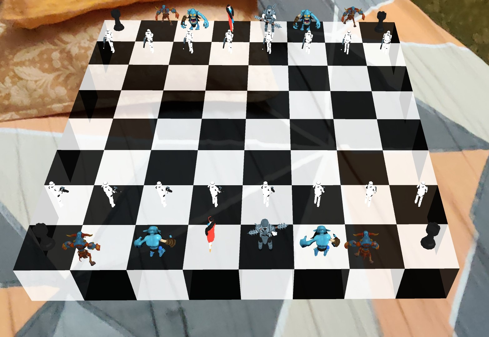

# webxr-chess-game
AR Chess game using WebXR device API

#### Abstract
AR gained huge popularity in the last couple of years and all thanks to
our mobile phones. AR requires some complex sensors, a display unit,
camera and processing power. Our phones have all the awesome
equipment already attached to it. This makes it easy for AR to reach
masses, which is the cool mantra for success of any product.
Chess is a classic board game that has been played for centuries. It is a
game that requires strategy, skill, and patience, and it has been the
subject of countless books, movies, and TV shows. As technology has
progressed many web based platforms have emerged which have
provided people to play this wonderful game online, with other chess
players and enthusiasts around the world at any time and anywhere.
However this experience comprises a two-dimensional board which
doesn’t provide the complete feel of a real-world experience of playing
chess. Secondly not many people possess chess boards and pieces for a
live experience. At the same time, it is considerably problematic to carry
chess boards and their pieces around whenever one wants to play. The
logistics are not pleasant for many chess players, enthusiasts and fans.
Thus in this project we propose a solution to the above problem, by
developing a Chess AR application through which anyone can play chess
at any time and anywhere with other people without losing on the
real-world experience. It eliminates the need of carrying a chess board or
chess pieces, and provides a real-life, three-dimensional chess
experience.

#### Set up instructions
Set up instructions are mentioned [here](https://codelabs.developers.google.com/codelabs/ar-with-webxr/#1). The documentation and other details can be found [here](https://drive.google.com/file/d/1eAFI5Tqm9r3gV51OZACnNyDxlNN8lBJ_/view?usp=sharing).

#### Current state of the application
The Chess game was built to get hands on [WebXR Device API](https://www.w3.org/TR/webxr/) and in no way game was expected to work fully. WebXR is still in development phase and developers from Mozilla, Google and Microsoft working together to make WebXR better and bring it in their respective browsers.

* If you observe all the chess pieces looks similar and for starter you can use the direction of chess piece to recognise which one is yours.
* I have not coded all the chess game rules

This application is only to demonstrate the power of WebXR.

